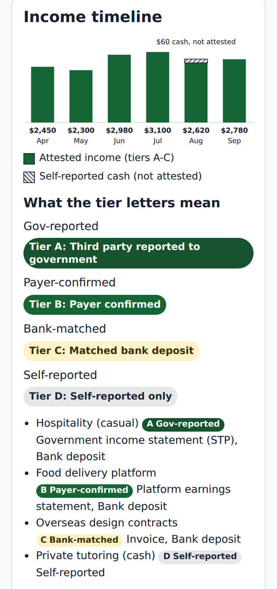
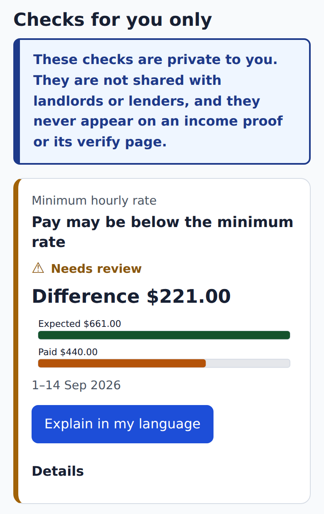
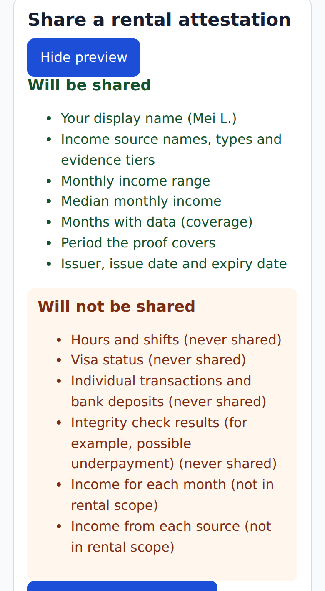
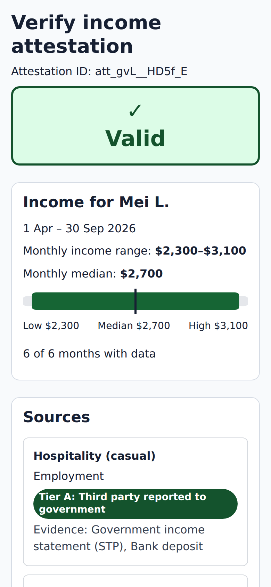
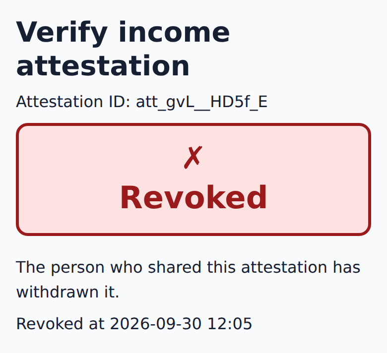
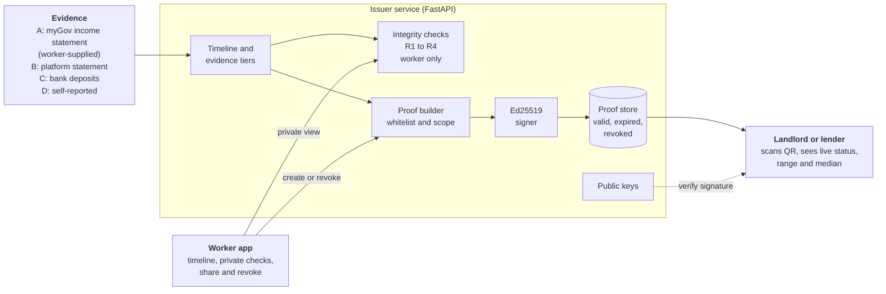
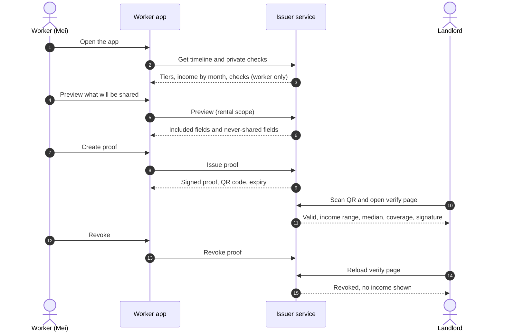

# BaeSlip

**Income that institutions can read.**

BaeSlip turns income scattered across jobs, apps and bank deposits into one **signed, scannable proof** that the worker controls. It is built for people whose income doesn't come as three tidy payslips: casual and shift workers, gig and platform workers, freelancers, and international students working under a visa hours cap.

Built by team **Data Baes** for the 2026 FEIT Hackathon, Airwallex Problem 2: *"Income without a payslip: what does financial infrastructure look like when irregular income is the default?"*

> **Demo data notice.** Everything here runs on **mock data** for one fictional worker, *Mei*. Nothing connects to a real bank, the ATO, an employer or a platform.

---

## Meet Mei

*Mei is a fictional, illustrative worker. Her numbers come from the demo data in this repository.*

Mei is 23 and studies in Melbourne on a student visa. She earns through four channels:

- a **casual cafe job**, rostered and paid fortnightly;
- **food delivery**, paid weekly by the platform;
- **freelance design** for a client overseas, invoiced in a foreign currency;
- a little **cash tutoring**.

In six months she earned about **$16,000**, between **$2,300 and $3,100 a month**.

### The problem

Mei applies for a flat and is asked for recent payslips. What she has is a roster app, cafe payslips, a delivery app screen, foreign invoices and a bank account: **five places, and no single document** a landlord can read. Her income is real, but it is *illegible*.

She has a private worry too. Twenty rostered hours at the cafe paid her **$440**, while the casual minimum would be about **$661**. She isn't sure, and she is afraid that asking could cost her shifts. Next fortnight's roster could also push her past the **48-hour** student-visa limit across her jobs without her noticing.

### How BaeSlip helps, in five steps

| 1. See every source, tiered | 2. A check only she can see | 3. Preview before sharing | 4. The landlord scans: Valid | 5. Mei revokes |
|---|---|---|---|---|
|  |  |  |  |  |
| One timeline. Each source is labelled **A to D** by how strong its evidence is. Her cash tutoring appears too, honestly marked *self-reported*. | Private checks flag that her cafe pay **may** be $221 short, and warn about the visa hours limit. Only Mei sees them. | Before anything is shared, Mei sees what the proof will include and what it will **never** include: hours, visa status, transactions and check results. | She creates a QR code. The agent scans it and sees **Valid**, $2,300 to $3,100 a month, a median of $2,700, and six of six months covered. | Mei can withdraw the proof at any time. The same link now says **Revoked** and shows no numbers. |

### Three ideas behind it

1. **Honest evidence, not a single "verified" stamp.** Every source says how well it is backed, from **A** (reported to government) to **D** (only the worker's word). The proof states what is known and how well.
2. **A proof a stranger can check.** A landlord or lender scans a QR code and sees a live status: valid, expired, revoked or not found. The proof is digitally signed, so anyone can confirm it has not been altered.
3. **Checks that protect the worker, and stay private.** The same data is checked for signs of underpayment or a visa-hours risk. Those results are shown **only to the worker**. They never appear on a proof, so a proof can never quietly "certify" underpayment, and the worker decides what to do next.

### What a proof shows, and what it never shows

| Shown on the proof | Never on any proof |
|---|---|
| Income sources and their evidence tier (A to C) | Hours and rosters |
| Monthly income range and median | Visa status |
| Months of data covered (for example 6 of 6) | Individual transactions |
| Period, issuer, issue and expiry dates | Underpayment or other check results |
| | Self-reported (tier D) income |

### Evidence tiers

| Tier | Meaning | Example evidence |
|---|---|---|
| **A** | Reported to government by a third party | Government (STP) income statement, notice of assessment |
| **B** | Confirmed by the payer | Platform earnings statement, payer-confirmed invoice |
| **C** | Matched to a bank deposit | An invoice whose payment is found in the bank feed |
| **D** | Self-reported only | Cash work the worker records themselves |

A source's tier is the **weakest** tier across its records. Tier D income is shown to the worker but left out of the proof.

### Why it matters

- **1,049,100** people held more than one job in Australia in the June 2026 quarter, 6.9% of employed people ([ABS Labour Account](https://www.abs.gov.au/statistics/labour/labour-accounts/labour-account-australia/latest-release)).
- **61%** of casual employees have no guaranteed minimum hours ([ABS Working arrangements, Aug 2025](https://www.abs.gov.au/statistics/labour/earnings-and-working-conditions/working-arrangements/latest-release)).
- **65%** of the 5,469 temporary-visa workers in the 2026 *Off the Books* survey who did not work on an ABN were paid less than their minimum entitlements under the Fair Work Act ([Migrant Justice Institute report](https://www.migrantjustice.org/off-the-books)).

People like Mei are not shut out because they earn too little. They are shut out because no institution can read what they earn.

### What this demo does not do

- **Mock data only.** No real bank, ATO, employer or platform connection.
- **Not a guarantee, not lending.** BaeSlip issues a statement about evidence. It does not guarantee rent or income, and it does not lend, hold funds or move money.
- **Adoption is voluntary.** A landlord or lender has to be willing to read the proof. It is something the tenant chooses to attach, not something anyone can demand.

More technical limits are listed under [Status and limitations](#status-and-limitations).

---

# Technical details

## Architecture



**The standard, not just the app.** The proof format (`schema/attestation.schema.json`), the tier definitions and the never-share list are the standard. This repository is one issuer that implements it. Any bank or fintech that already holds a worker's data could become an issuer and sign proofs in the same format, so a landlord or lender can read any of them the same way.

Proofs are built from a **whitelist** of fields, never by deleting sensitive fields from a larger record, so a newly added field cannot leak by accident. The default rental scope also omits the month-by-month series; a `lending` scope is defined in the spec for lenders.

### One proof, end to end



## Integrity checks (worker only)

These are prompts to look closer, not accusations. Wording is limited to *may*, *needs review* and *unable to verify*.

| Rule | What it looks for | Main caveat |
|---|---|---|
| **R1** minimum hourly rate | Pay for rostered hours below the configured casual minimum ($33.05/h, the national minimum wage plus the 25% casual loading) | Applies only where no award or agreement sets a different rate |
| **R2** delivery minimum | Weekly platform payout below the configured minimum per engaged hour | Platform exports may not include engaged time; the rate should be checked against the FWC decision |
| **R3** Payday Super | Super not received within 7 business days of payday | The demo skips weekends only, not public holidays |
| **R4** student visa hours | Any 14-day window that reaches 48 hours across all jobs, warned in advance from planned shifts | Needs every job's roster; the exact counting method should be confirmed with Home Affairs |

## Tech stack

| Layer | Choice |
|---|---|
| Backend | Python 3.11, FastAPI, Pydantic v2 |
| Signing | Ed25519 over canonical JSON (`cryptography`) |
| Frontend | React 19, Vite, React Router, `qrcode.react` (JavaScript) |
| Explanations | Claude API for plain-language explanations of a check, with an offline template fallback. The AI only rewords a check; it never computes money or hours |
| Tests | pytest (backend), Vitest and Testing Library (frontend), CI on GitHub Actions |
| Tooling | Pinned dependencies, one-command setup |

## Run it

Requires Python 3.11 (or [uv](https://docs.astral.sh/uv/), which installs it for you) and Node 22.

```bash
git clone https://github.com/JackLee083/DataBaes_BaeSlip.git
cd DataBaes_BaeSlip
bash scripts/setup.sh          # installs pinned dependencies, runs the contract check and all tests
```

Run the backend and the frontend in two terminals:

```bash
# terminal 1: backend
cd backend
source .venv/bin/activate      # Windows Git Bash: source .venv/Scripts/activate
uvicorn app.main:app --port 8000

# terminal 2: frontend
cd frontend
VITE_USE_FIXTURES=false VITE_API_BASE=http://localhost:8000 npm run dev
```

Open `http://localhost:5173/app`. With no environment variables the frontend runs from the committed fixtures and needs no backend.

**Scanning the QR with a phone.** The quickest way is `bash scripts/demo-lan.sh`. It finds your current LAN IP, writes the two settings below and starts both servers on the network. Run `bash scripts/demo-lan.sh fixtures` to start the frontend only, from the fixtures. Run it again whenever the IP changes.

To do it by hand: the QR code points at `PUBLIC_WEB_URL`, so use your machine's LAN IP, put the phone on the same network, and start both servers listening on the network:

```bash
# backend/.env
PUBLIC_WEB_URL=http://<your-ip>:5173
# frontend/.env.local
VITE_USE_FIXTURES=false
VITE_API_BASE=http://<your-ip>:8000
```

```bash
uvicorn app.main:app --host 0.0.0.0 --port 8000 --env-file .env    # in backend/
npm run dev -- --host                                                # in frontend/
```

To see the AI explanation instead of the template text, add `ANTHROPIC_API_KEY` to `backend/.env`. Without it the app falls back to the standard explanation.

### Try it

1. Open `/app`: Mei's timeline shows four sources with tiers A to D, and four private checks (for example, R1 shows $440 paid against $661 expected).
2. **Preview** what will be shared, then **Create** the proof.
3. Scan the QR with a phone: the verify page shows a valid proof with the range $2,300 to $3,100 and a median of $2,700.
4. **Revoke** it and reload the phone: the page now shows the proof as revoked, with no income figures.
5. Open **Add your data** (`/data`) to see how a worker would give evidence to the issuer: connect a bank through the Consumer Data Right, add the myGov income statement and platform statements, and enter self-reported shifts and cash. It is a demo: nothing is uploaded or processed.

## API

| Method | Path | Purpose |
|---|---|---|
| GET | `/workers/{id}/timeline` | Income records, source tiers and monthly totals |
| GET | `/workers/{id}/checks` | Integrity checks (worker only) |
| POST | `/checks/{check_id}/explain` | Plain-language explanation of one check |
| POST | `/attestations/preview` | What a proof would and would not include |
| POST | `/attestations` | Issue a signed proof and its verify URL |
| GET | `/attestations/{id}/verify` | Live status and the signed proof |
| POST | `/attestations/{id}/revoke` | Revoke a proof |
| GET | `/.well-known/baeslip-keys.json` | Issuer public keys, so anyone can verify signatures |

## How we built it

We built BaeSlip during the hackathon as a small human team directing AI coding agents. The people made the product decisions, approved every plan, and merged and tested the work; the agents implemented the plans, test-first.

| Agent | Tool and models | What it built |
|---|---|---|
| Claude-1 | [Claude Code](https://claude.com/claude-code): Claude Opus 5.5 to plan, Claude Sonnet 5.5 subagents to build | The contract (Pydantic models, JSON Schema, fixtures), signing, proof builder, proof store and API |
| Claude-2 | Claude Code, same models | Mock data, evidence tiers, deposit matching and the income summary |
| Claude-3 | Claude Code, same models | Frontend scaffold, API client, share flow, verify page and spec page |
| Codex-1 | OpenAI Codex: GPT-6 SOL to plan, GPT-5.6 Terra to build | Integrity checks R1 to R4 and the AI explanation |
| Codex-2 | Codex, same models | Visual system, Mei's timeline and the check cards |
| Codex-3 | Codex | Reviewer only: reviewed every plan and the contract |

How the work was organised:

- **Contract first.** The models, schema and example responses were agreed before anyone built, so backend and frontend could be written in parallel against the same fixtures. `scripts/check_contract.py` keeps them in agreement.
- **Test-first.** Each task started with a failing test; `scripts/setup.sh` runs the contract check and both test suites.
- **Review before build.** Every plan was reviewed by another agent (Codex-3 in the first round; Claude and Codex reviewing each other later) before the team approved it.
- **Later rounds** (readability, the rename to BaeSlip, charts and the "Add your data" page) used the same setup.

The app itself uses the Claude API only to reword a check in plain language; all money, hours and dates are computed by ordinary, tested code.

## Repository layout

```
backend/          FastAPI service: models, evidence tiers, integrity rules, proof builder, signing
frontend/         React app: worker app, verify page, "Add your data" page, standard spec page
schema/           JSON Schema of the proof (the standard)
fixtures/         Example API responses; the contract between backend and frontend
scripts/          setup.sh, the contract check, fixture signing and the phone demo launcher
assets/           Screenshots used in this README
```

## Status and limitations

What works: the whole flow above, on mock data, with backend and frontend test suites and a contract check that keeps fixtures, models and schema in agreement.

What this demo does not do, stated plainly:

- **Mock data only.** No real bank, ATO, employer or platform connection.
- **No third-party access to tax data today.** Trade press reports that tax secrecy rules stop the ATO sharing a taxpayer's data with private parties even with consent, and that the government is exploring sharing some ATO-held data through the Consumer Data Right. The demo assumes the worker downloads their own income statement and supplies it.
- **The income statement shows year-to-date totals.** In myGov, STP shows what an employer has reported so far this financial year, not each pay. The demo tags each employer pay with STP evidence. A real issuer would take each pay from the payslip and check the payslips against the STP year-to-date total.
- **Revoke has no authentication.** A real deployment must verify the worker's identity.
- **Not a guarantee, not lending.** BaeSlip issues a statement about evidence. It does not guarantee rent or income, and it does not lend, hold funds or move money.
- **Adoption is voluntary.** A landlord or lender has to be willing to read the proof. Where rental application forms limit what a landlord may request, the proof is something the tenant attaches, not something anyone can demand.

## Roadmap

1. **Bank and fintech issuers** using Consumer Data Right *insights*, which let an accredited recipient share a verified income figure with a party the customer chooses.
2. **ATO data through the Consumer Data Right**, as the government explores it, so tier A no longer depends on the worker downloading a statement.
3. **Lending scope** for lenders that must verify income and its variability under ASIC RG 209, with a month-by-month series and per-source detail.
4. **Worker authentication** on issue and revoke, and per-recipient sharing controls.

## Team

**Data Baes**, 2026 FEIT Hackathon, University of Melbourne.

- [Pin Ju Chiu](https://github.com/pinjuchiu)
- [Tzu-Hsun Hsu](https://github.com/tzuhsunhsu)
- [Yi-Ting Huang](https://github.com/yiitiing)
- [Jack Lee](https://github.com/JackLee083)
- [alicezihyi](https://github.com/alicezihyi)

## License

No license is granted: all rights are reserved by the team. You are welcome to read the code; please ask before reusing it.
